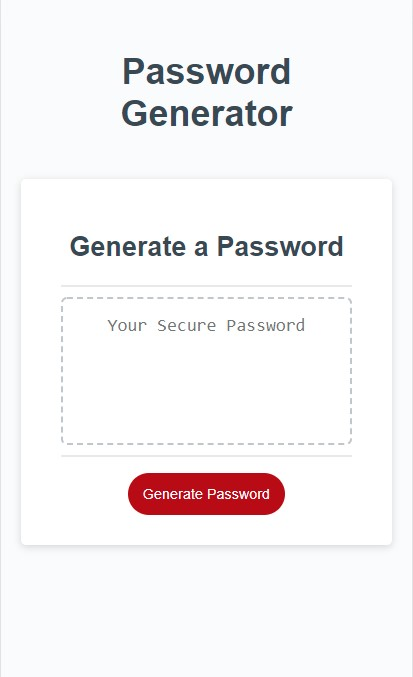

# Password Generator
This is a website that generates random passwords based upon a user's input of password length (8 to 128 characters) and the choice of different types of characters including:
* Uppercase letters
* Lowercase letters
* Symbols

This website uses javascript to prompt for responses and to generate the password. Site is mobile friendly.

Link to project  https://smashercoder.github.io/password-generator/

 